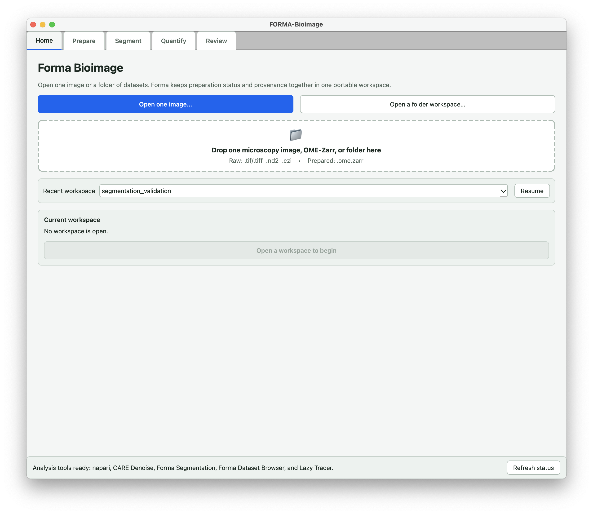
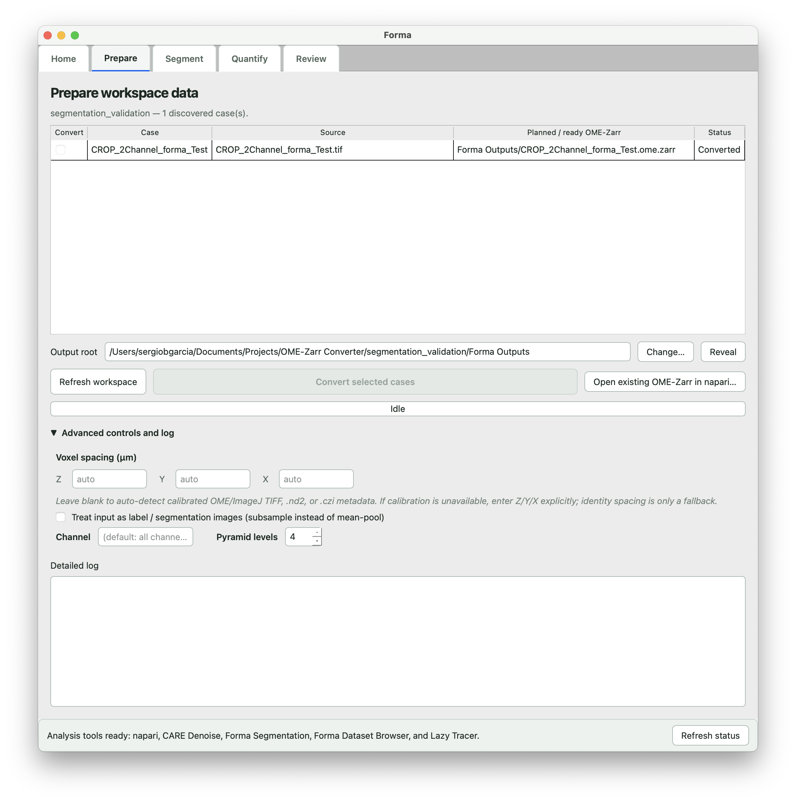
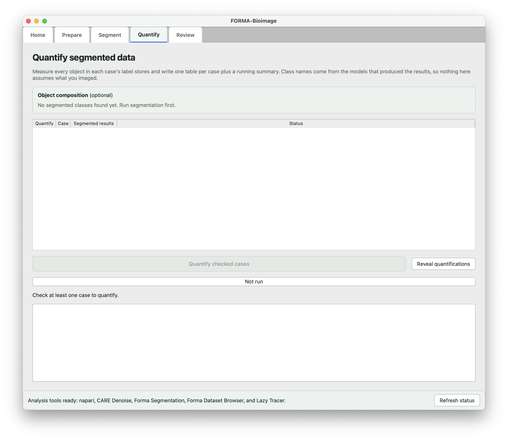
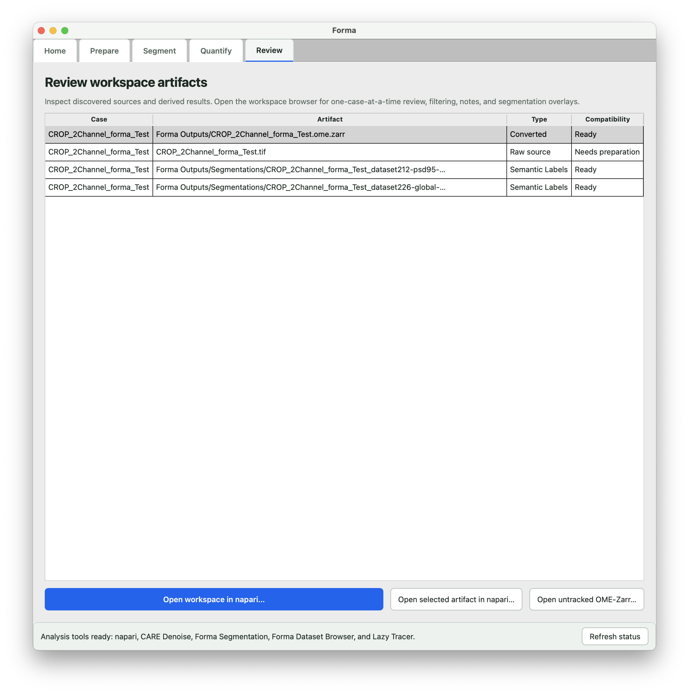

# Forma

Forma is a desktop app for 3D microscopy analysis on Mac and Windows. You open a stack or a folder of stacks, convert it to OME-Zarr, segment it with a deep-learning model, measure the segmented objects, and review or correct the result in napari. No Python setup is needed. The app installs its own analysis tools the first time you ask.

## Highlights

- **Raw files in, OME-Zarr out.** TIFF, ND2, and CZI stacks, 2D to 5D, are converted once to OME-Zarr, the open community standard for large bioimages. Every later step reads that store.
- **3D deep-learning segmentation on a Mac.** The nnU-Net engine runs on the GPU of an Apple silicon Mac, on an NVIDIA card on Windows, or on the processor.
- **Your model or ours.** Model packages are self-describing. Any 3D single-channel nnU-Net model runs in Forma once it is packaged with a short manifest.
- **Quantification that follows the model.** The Quantify tab fills in the classes and the measurements from whichever model produced the result, so the same tab quantifies anything a model can segment, from whole-cell morphology to organelles. Nothing about a particular structure is built in.
- **Large volumes.** An image above the model's limit is segmented in pieces, identical to the whole-image result on the test data, and a stopped job continues from the last finished piece when you run it again.
- **napari, bundled.** Forma installs napari and its plugins for you and streams the raw fluorescence and the segmentation from the OME-Zarr pyramid, so a large volume opens without loading it whole.
- **Corrections kept.** Edited labels are saved as a new revision beside the original. A segmentation result is never overwritten.
- **Lazy Tracer.** Trace a neuron through a large volume in napari and export the path as an SWC file for downstream tools.
- **A workspace, not loose files.** One image or a whole folder. Everything Forma writes lands in a `Forma Outputs` folder next to your images, tied to each image by stored provenance, not by file names.
- **One version for Mac and Windows.** The same app and the same engine on both, with no Python setup.

## Download

Get the two files for your computer from the [latest release](https://github.com/serg-bg/Forma/releases/latest).

| Computer | Files | Size |
|---|---|---|
| Apple silicon Mac | `Forma-mac.zip` and `Forma-mac.zip.sha256` | 157 MB |
| Windows PC | `Forma-windows.zip` and `Forma-windows.zip.sha256` | 18 MB, plus 0.5 GB on first start |

Plan for about 4 GB of disk in all: the app, about 2 GB of analysis tools, and the 1.1 GB model.

The `.sha256` file lets you check that the zip arrived intact. The check is optional. On a Mac, paste `cd ~/Downloads && shasum -a 256 -c Forma-mac.zip.sha256` into Terminal; it prints `Forma-mac.zip: OK`. On Windows, run `Get-FileHash $HOME\Downloads\Forma-windows.zip` in PowerShell and compare the hash with the one in the `.sha256` file.

## Install on a Mac

Forma runs on Apple silicon Macs. It was built and tested on macOS 15.

1. Double-click `Forma-mac.zip`, then move `Forma.app` into **Applications**. If your browser already unzipped the download, `Forma.app` is in Downloads.
2. Double-click `Forma.app`. macOS says it cannot verify the app, because Forma is not notarized by Apple. Close that message.
3. Open **System Settings**, click **Privacy & Security**, scroll down to the Security section, click **Open Anyway**, and confirm with your password.
4. Click **Open** in the warning that appears. macOS remembers the choice.

## Install on Windows

For GPU segmentation, Windows needs an NVIDIA card of the GTX 16 or RTX 20 series or newer, with driver 580 or later. The NVIDIA Control Panel shows the driver version under System Information. Without such a card, Forma segments on the processor, which has not been tested. A Windows user name longer than about 26 characters stops the engine's installation, and Forma states the reason.

1. Download `Forma-windows.zip`. If the browser asks whether to keep the file, keep it.
2. Forma refuses to start from a folder that mixes two versions, so extract into a new folder, never over the folder of an earlier version: right-click the zip, choose **Extract All…**, pick the new folder, then **Extract**.
3. Open the extracted `Forma` folder and double-click `Forma` (type "Windows Command Script"). The download is not signed, so Windows may warn that the file comes from the internet. If the warning has a **Run** button, click it. If it shows only **More info**, click that, then **Run anyway**.
4. The first start downloads about 0.5 GB and takes a few minutes. A black window shows the progress and closes by itself once the app opens. Later starts open the app directly.

## Set up the analysis tools and a model

1. In Forma, click **Install analysis tools** at the bottom of the window. This installs napari, the Forma plugins, and the segmentation engine, about 2 GB, once. Keep the window open until it reports that the installation finished.
2. Open the **Segment** tab and pick a model from the **Model** list. The first pick asks for your name, email, and institution, all three required, then downloads the model once (1.1 GB) and keeps it on your computer.

A model package already on disk can be chosen with **Choose a local package…** instead. That needs no network.

### The model

**Dataset226 neuronal morphology Global V6** segments one-channel 3D confocal stacks of neurons into dendrite, spine core, spine edge, spine neck, soma, and axon. It was trained on voxels near 65 nm in XY and 200 nm in Z, and Forma resamples other voxel sizes to that grid, within a factor of four. It is the model distributed with RESPAN ([Bernal-Garcia et al., Cell Reports Methods 2025](https://doi.org/10.1016/j.crmeth.2025.101179)), where its validation is described. The weights are licensed [CC BY-NC 4.0](https://creativecommons.org/licenses/by-nc/4.0/), for noncommercial use.

## The five tabs

Forma keeps one image or a folder of images in a workspace and takes it through five tabs, in order.

**Home** opens one image, an existing OME-Zarr, or a folder workspace, and resumes a recent one.

**Prepare** lists the images it found. **Convert selected cases** converts the checked ones to multiscale OME-Zarr. It reads the voxel spacing from the file. When the file has none, you type it in.

On **Segment** you pick the model, the compute device, and the channel. **Check selected data** checks the images against the model, and **Run checked batch** segments them one at a time. An image above the model's size limit runs in pieces, with the time left shown as it runs. On the test image the piecewise result was identical to the whole-image result.

**Quantify** measures every object in the segmented images into one table per image and a summary table that grows with every image. The class names come from the model.

**Review** opens the workspace, one result, or any OME-Zarr in napari. There, the Forma plugins page through the images of a workspace, edit labels and save them as a new revision beside the original, trace a neuron and export the path as SWC, and, on a Mac, denoise with CARE.

## Known limits

- Windows limits file paths to 260 characters. Forma says so when a data folder is too deep. Keep data folders short and near the top of a drive.
- Time series convert and display with their time axis, but segmentation, tracing, and label editing refuse them. Convert a single timepoint for that work.
- Forma is not notarized by Apple and not signed on Windows, hence the warnings during installation.

## Feedback

Forma is new and will have rough edges. Report them as [issues](https://github.com/serg-bg/Forma/issues). The issue form asks for the Forma version, your computer, what you did, what happened, and the log text. Do not upload raw microscopy data or model files.

## License

- The Forma app: [GPL-3.0](LICENSE).
- The model weights (Dataset226) and the CARE denoising weights in the Mac app: [CC BY-NC 4.0](LICENSE-WEIGHTS), noncommercial use.
- Third-party components keep their own licenses.

## Cite

If Forma contributes to your work, cite it with the [CITATION.cff](CITATION.cff) file in this repository, and cite the model's paper:

Bernal-Garcia S, Schlotter AP, Pereira DB, Recupero AJ, Polleux F, Hammond LA. A deep learning pipeline for accurate and automated restoration, segmentation, and quantification of dendritic spines. Cell Reports Methods. 2025;5(10):101179. https://doi.org/10.1016/j.crmeth.2025.101179

## Author

Sergio Bernal-Garcia, Zuckerman Mind Brain Behavior Institute, Columbia University. Franck Polleux Lab. smb2318@columbia.edu
